# Datawrapper tutorial

###### Using Datawrapper.de to create charts and maps. 
------

We use Datawrapper to create charts all the time at NJAM. But it can be difficult to pick up, especially with odd directions and lots of detailed options. Here's a primer to get you up to speed on Datawrapper

## Part 0: Prequel to Datawrapper training - Excel basics. 

You may have opened an Excel file, maybe played around with copying and pasting and other things. But analysis is a bit more elusive. Here's a tutorial to get you started on some common Excel tips.

### Open your dataset

This data is based on New Jersey's inventory of zoo animals. The original data came back to us in a PDF like this:

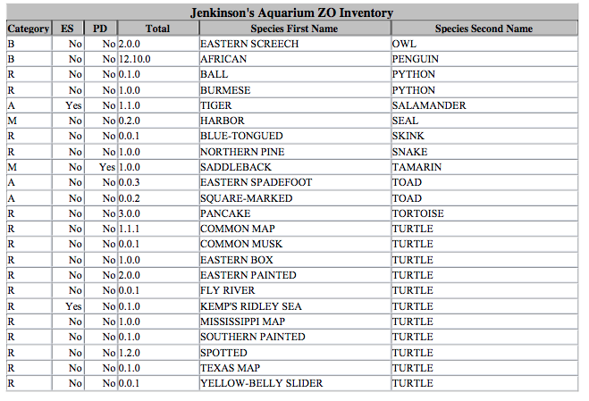

I took it from the PDFs with a tool called Tabula and created separate datasets for each zoo. Then I combined all of those datasets into one. That's the Zoo_Total.csv.

Before you even start on the Excel file, I want to show you what the dataset looks like to the computer. You can see that pretty easily with a csv file -- it's just a text file with some commas thrown in. Try right clicking on the file and telling it to open in Text Edit, Notepad or a different text editor. It should look something like this:

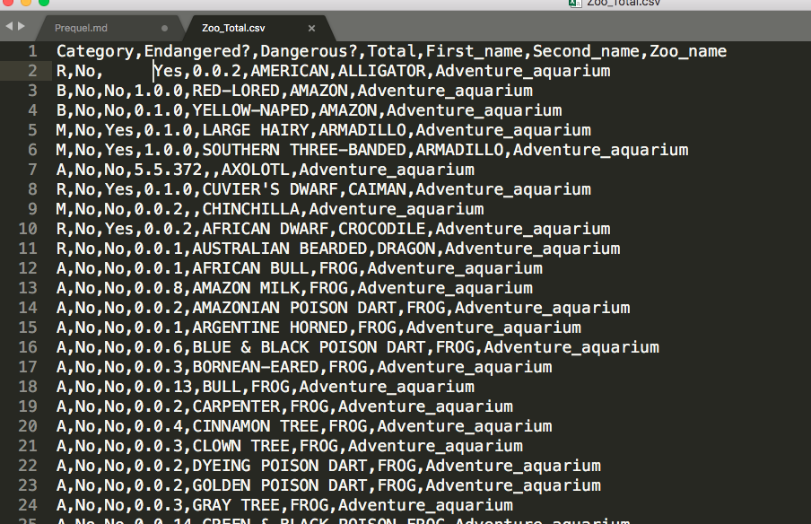

Keep in mind that csv files don't save formulas or other fancy things you might add to an Excel spreadsheet. If you want to add that stuff to your file, you might want to save it as an Excel spreadsheet as soon as you open it.

### Grids, selection, and hidden notes

Time to open up that dataset. First off, scroll through and notice some basic things that could mess up your calculations:

1. Are all the columns labeled correctly?
2. Are the column names in the top row? Are the column names only one row, or are they multiple rows?
3. Are all the rows aligned to the right column? Are there any "dangling" cells?
4. If there are numbers, are the numbers aligned to the right, like they should be? Usually Excel puts numbers on the right of the cell, and text on the left. If that's screwed up, you may have a number being read as a text value.
5. Are there blank cells? Cells with negative numbers? Cells with things like #N/A written in them?
6. For columns that only have a handful of values (like Yes or No), are there any obvious misspellings?

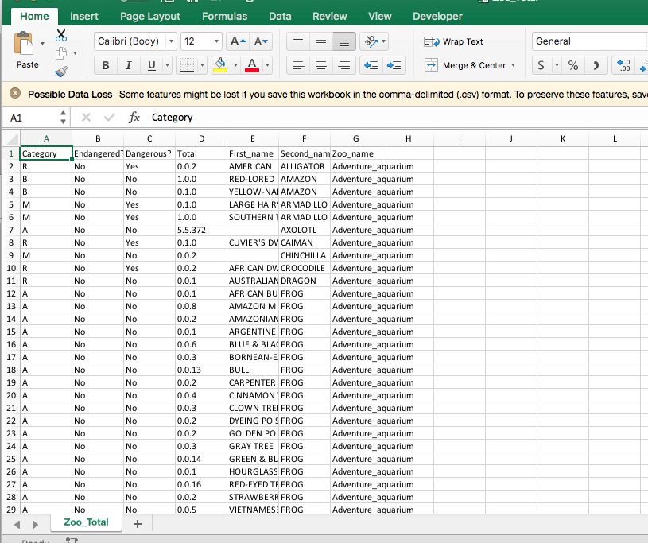

Now, before we go on, do you know how to select a cell? How about copying and pasting?

If you need a refresher course on that stuff, [this spreadsheet](https://docs.google.com/spreadsheets/d/1pEJ8tFpMvRKaztSl-OKJBNOWzu9SPDOcmcp2eGm-fOQ/edit?usp=sharing) is a good start. Make a copy and go crazy.

Just to overview a little bit: 

- Click on a single cell one to highlight it and view it in the "formula bar" (the big white bar up top). Double click to change the value in the cell.
- When you select a cell, the row number (on the left) and column letter (on the top) will light up. To select an entire row, click on that number. To select an entire column, click on that letter. To select a range of cells, click on one cell and drag your mouse over the other cells you want to select.
- Sometimes, the displayed value is not the same as the value Excel sees — particularly if you have a formula. To see the "real" value, click on the cell and take a peek at the formula bar.
- You can copy and paste cells, rows, columns and tables by selecting them, then copying and pasting like you would in an Excel spreadsheet. There's one caveat: You can either paste the thing Excel sees -- with the hidden formulas and all -- or the thing that you see. To paste without formulas or hidden stuff, use Edit - Paste - Values.

### First data cleaning point: Get rid of those dots!

You want to find out the total number of each animal? Great, too bad it's hiding in that weird "Total" column. Somehow, you need to separate the male, female and no-gender stuff into different columns. To do that, you need to use the magic of "Text to columns."

To do that, you first need to make room for it. Highlight columns E and F and right click - Insert columns. Then highlight column D, the column you need to separate. Go to the Data tab and click on Text to columns. 

Something will pop up like this:

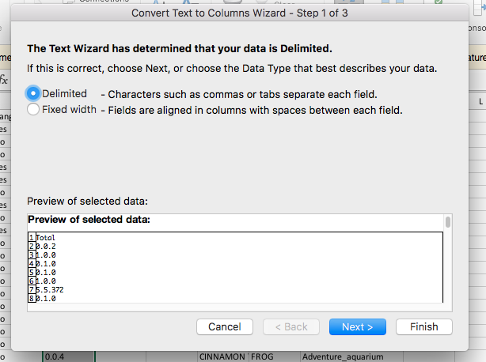

Your first option will tell the computer "here's the thing that's separating (delimiting) the values I want to turn into individual columns." The second tells the computer "I want you to turn each thing x spaces away into a different column." You have a thing separating your values, not a space, so you want the first option -- the "Delimited" one.

The second screen will ask you, "what's the thing that's separating your data?" In this case, each value is separated by a period. It's not one of the preset options, but no worries: You can input it.

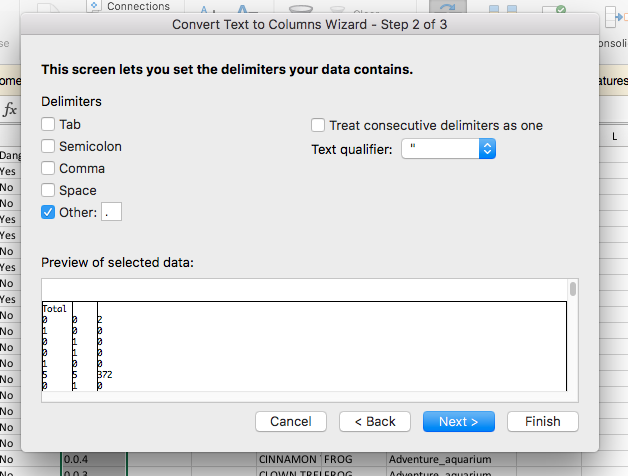

You don't have to worry too much about the last screen: Set it to General unless you have a reason to do otherwise. Now click "Finish." You should now have this showing:

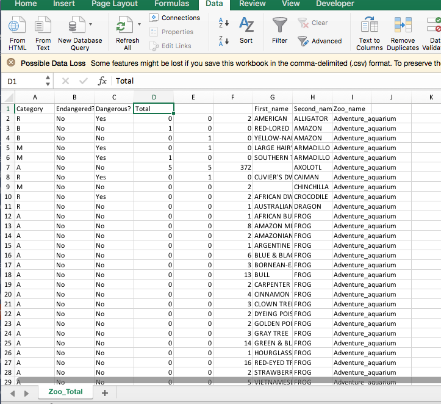

### Getting the totals with FORMULA

You have the values you want, but you don't quite have the right results. You don't want the number of male or female animals, you want the combined numbers, right? To do that, you have to try something new: A formula.

Formulas tend to scare reporters, and I can see why: Their odd syntax, hidden nature and huge variety make them hard to grasp at first. But for this exercise, we are going to use the simplest formula you can possibly imagine: the SUM function.

First off, let's get used to what formulas look like. Every formula has a couple different components:

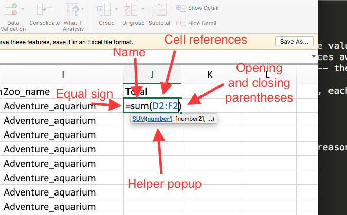

- The equal sign: It tells Excel "This isn't a regular cell value, it's a formula."
- The name of the function: It tells Excel what function you want to use.
- The opening and closing parenthesis: It tells Excel, "The thing you want to run is inside this parenthesis"
- The cell reference: These are the cells you want to run the function for. You can select cells in a couple different ways. You can write in the cell reference you want, such as typing in "D2" to reference the second cell in the forth column. Or, once you've written =Sum(, you can click and drag over the cells you want to select. The ":" means "Select from this cell to this cell." 

Once you've got the formula you want, hit Enter and watch Excel work its calculation magic. If a little yellow triangle pops up, you've got an error. Clicking on that triangle tells you the nature of the error, but I'll admit Excel is frustratingly vague about those errors sometimes. If you need to access that formula again, click on that cell then start typing in the formula bar, or double-click on the cell.

Ready to run that formula for the entire column? You can do it two ways: Mouse over the lower right hand corner of that cell until you see a little black cross. You can hold and drag the cross down to run the formula in those cells, or double-click on the cross to automatically fill the bottom cells.

As you copied the formula into other cells, Excel changed the cells reference to match that area. For example, on row 6, Excel guessed that you wanted to run the formula on other cells in the sixth row: 

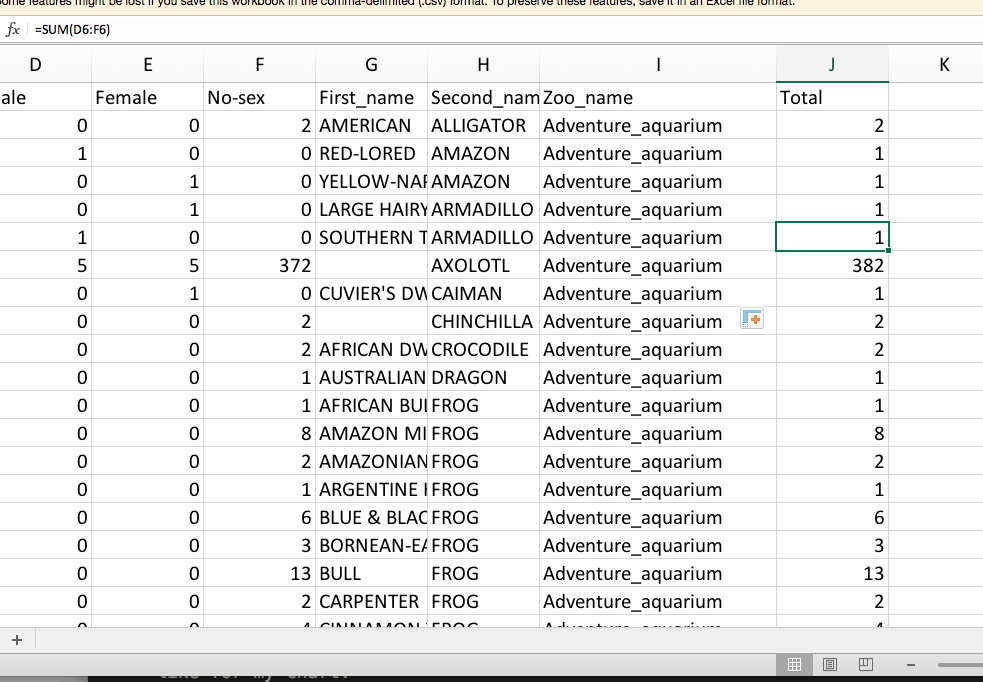

Sometimes you don't want the formula's cell reference to change, but just want to repeat the same results all over again. To do that, you'll need to use a "$" like this: 

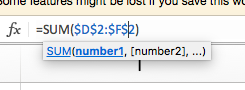

For now, you don't need to worry about it.

### Create a table, sorting and filtering

If your dataset is in a clean, grid format, it can be helpful to make it into a table. Making a table means that Excel automatically recognizes the range of your data, making it easier to perform little Excel tricks as you go along.

To create table, select a cell that is in the right range of your data. (I like to select A1). Then go to the Home tab and click on "Format as Table." It'll give you a couple style options; I'd suggest picking the plainest one, so you don't get overwhelmed by backgrounds and text colors.

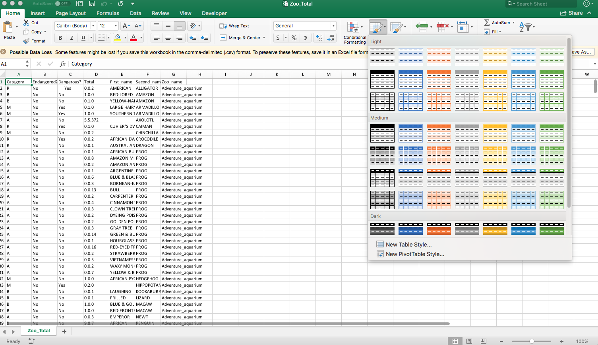

After you've created the table, you'll notice that a few things have changed. For one, your formulas will automatically fill to the bottom of the dataset. You'll also notice a few small arrows next to each column name. That will help you with sorting and filtering.

Try clicking on one of those arrows. You'll find something that pops up like this: 

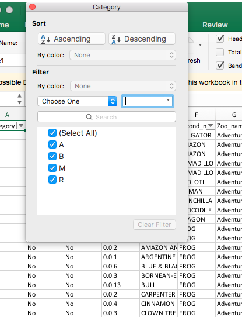

You can sort the table by that column by clicking on the ascending or descending buttons. You can also filter the dataset by clicking on the check marks next to the different values.

### Pivot tables

Pivot tables are the tool with probably the biggest return for the amount of learning you'll need to understand them. That being said, they can seem odd and unintuitive at first. The key is to play around with things for a bit until things start being shaped the way you want.

Pivot tables are sometimes called "reshaping" tools. That's because they are designed to combine and divide your datasets, especially to let you summarize your data. That can be helpful if you want to know the totals of a category, or want to organize your data by county and town, for example.

To start working with pivot tables, select a cell in your data and go to the Insert tab. Pivot table will be the first option in the tab, and an automated popup will guess where your data lives. If that looks good, click ok.

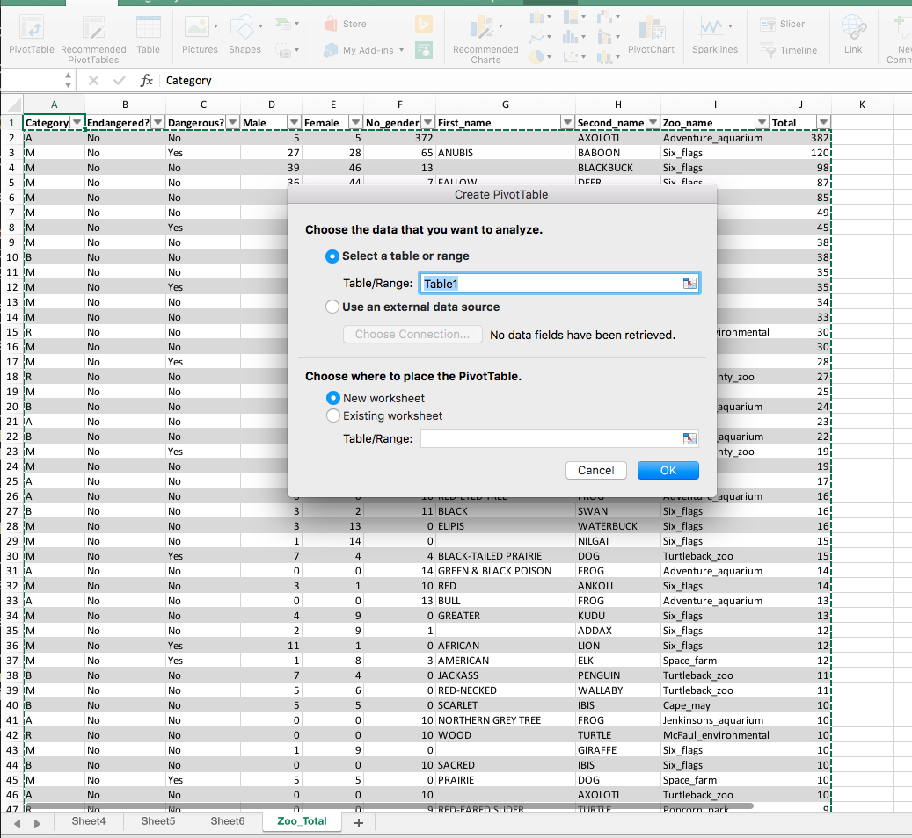

A new spreadsheet will pop up with a Pivot table tab and a "field list", like this.

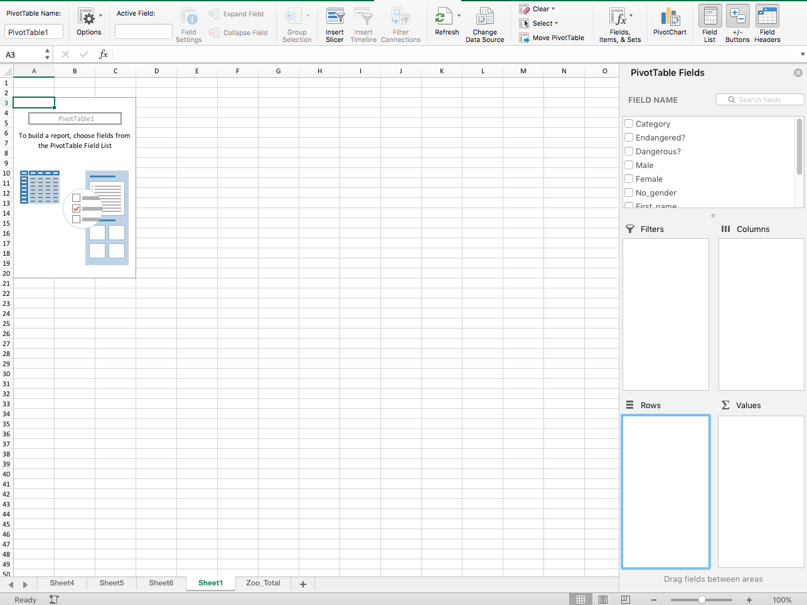

The field list includes each of your column names — all of the data you can choose to add or ignore. To start analyzing a field, just click on the box next to the name. I'm interested in finding out how many animals there are in each zoo, so I clicked on the "Zoo" column.

The bottom of the field list has four options: Filters, Columns, Rows and Values. Rows are the field you want to appear in the row of your pivot table. Columns are the field you want to make into the columns of your pivot table. Values are the numbers squeezed in between. Excel guessed that I wanted zoos as a value, and then guessed I wanted a count of all the times zoos appeared in the dataset...

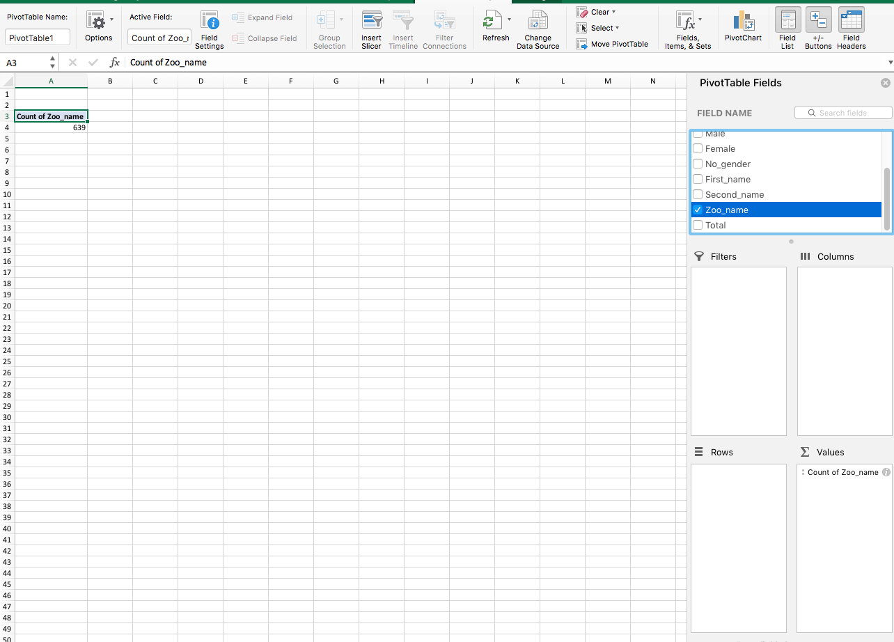

But that's not the case! I want the totals for each _individual_ zoo, right? In other words, I want to make each zoo its own row in my pivot table. To do that, I simply drag the thing under "Values" to be under "Rows."

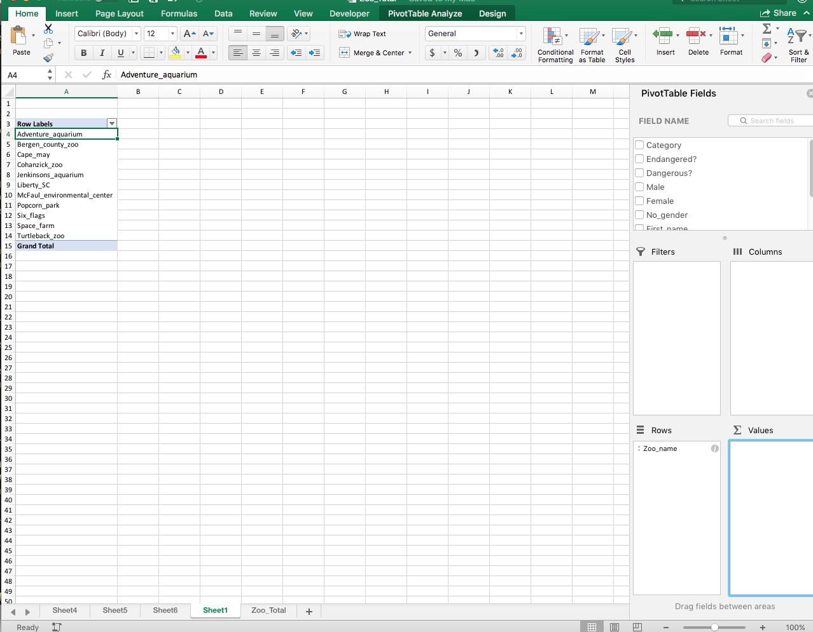

Now we need numbers, right? So let's try the field that contains numbers. Click on "Total" and make sure it's under the values section.

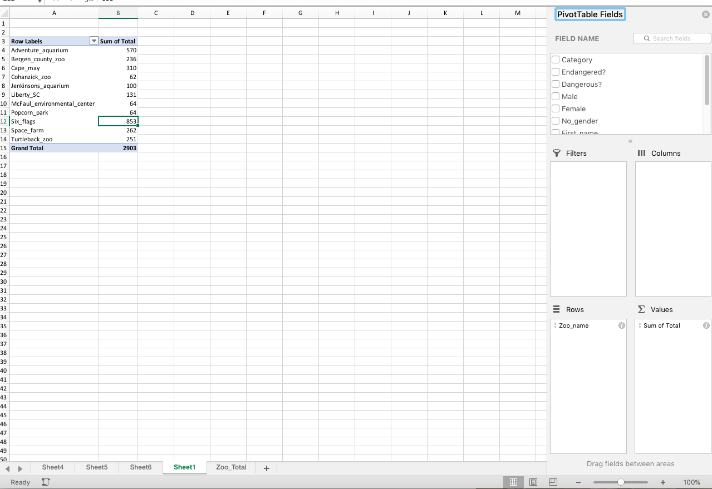

You've got it! Now we can see that Six Flags had the most animals of any zoo.

This is only one of many ways to make a pivot table. There are so many ways to slice and dice this data, I can't really begin to share them. But here are some example screenshots:

With columns:
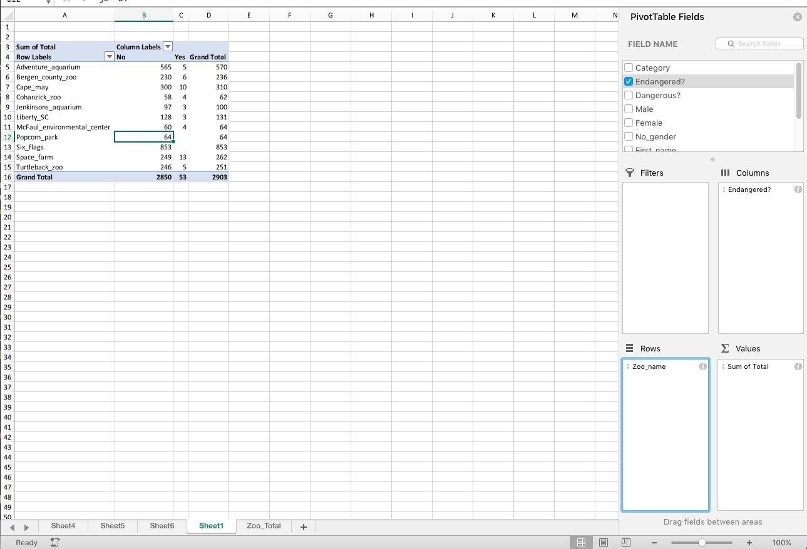

With multiple layers:
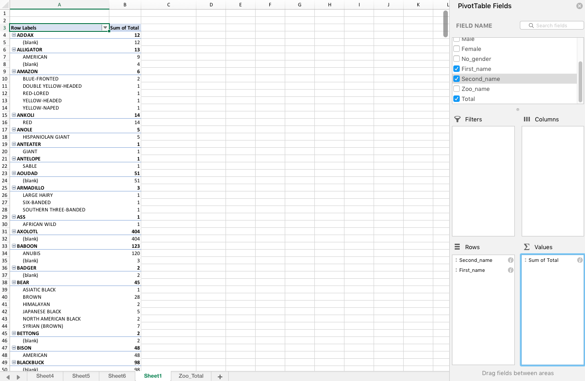

By changing "Sum" to "Average":
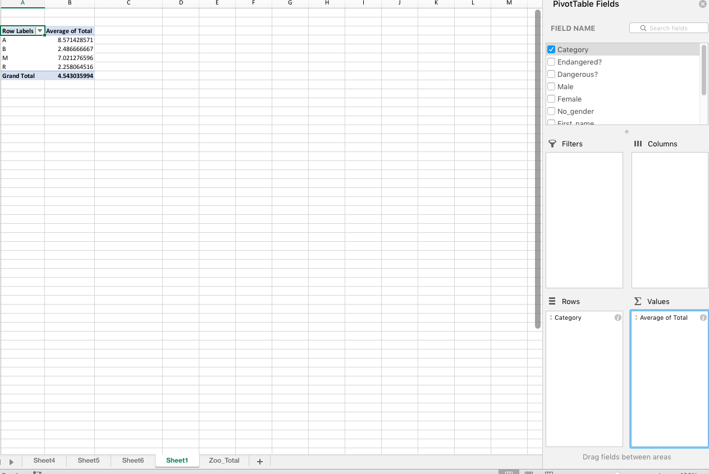

A couple of housekeeping notes about pivot tables:

1. If the field list disappears, just click on a cell in the pivot table again.
2. To change the way a value is calculated -- "Sum" to "Average", for example -- click on the little _i_ next to the name of the field.
3. To get rid of a field, uncheck it or drag it outside of Excel.
4. Pivot tables don't automatically refresh when your data changes — there's a refresh button in the pivot table tab, but you should also double-check to make sure it caught all your new data. You can always create another one if it's not working.
5. To sort a pivot table, click into the field you want to sort, go to the Data tab, and click on one of the sort buttons.
6. Formulas work a little weird. It's better to just copy and paste the pivot table as values somewhere else in your sheet.

## Resources and more

A handful of other places to look for help:

- [The basics of Excel selections]((https://docs.google.com/spreadsheets/d/1pEJ8tFpMvRKaztSl-OKJBNOWzu9SPDOcmcp2eGm-fOQ/edit?usp=sharing). It's referenced above, but just to reiterate: This will be a huge help if you need to understand what A1 is or how to drag some text.
- Mary Jo Webster's [basic excel tutorial](http://mjwebster.github.io/DataJ/BeginnerExcel.html), [pivot tables tutorial](http://mjwebster.github.io/DataJ/pivottables.html) and [Excel Magic tutorial](https://mjwebster.github.io/DataJ/tipsheets/ExcelMagic.pdf) on her data journalism [website](http://mjwebster.github.io/DataJ/). These are resources for a college course she teaches, but it's helpful for dealing with the dirty data we get from records requests. If you need to know how to clean a date or take the whitespace out of a cell, this is a great reference.
- [NICAR tutorials, slides and more](http://blog.chryswu.com/2018/01/23/nicar18-slides-links-tutorials/). NICAR is the national organization for data journalists, which hosts a yearly conference that includes plenty of training.

Best of luck, and happy sheeting!

**Learned something? Want to take it to the next level? Check out [Part 1: Basic Chart.](../Part_1.md)**