# Datawrapper tutorial

###### Using Datawrapper.de to create charts and maps. 
------

We use Datawrapper to create charts all the time at NJAM. But it can be difficult to pick up, especially with odd directions and lots of detailed options. Here's a primer to get you up to speed on Datawrapper

### Part two: maps, maps, maps.

Maps are more advanced to use than charts, but Datawrapper makes them as easy as possible. You can make county, Congressional district, and state-by-state national maps (but not town maps). If you've gotten comfortable with charts and are ready to move on to the next step, here's how you can do it.

#### Get your data and add some geography to it.

Perhaps the trickiest part about mapmaking comes before you even log into Datawrapper: Getting the geographic codes and attaching them to your data. You can't just plug in a list of addresses and expect DW to work with them! There are two kinds of codes you can use:

1. Latitude and longitude coordinates. These are only present on a handful of datasets, but they're pretty simple to use if you have them. 
2. Census-created FIPS codes, which Datawrapper uses to find out what county or state you're talking about. That's the type we're gonna be using today.

Today's map will be a dataset that comes with FIPS codes already: a Census dataset of each county's median income.

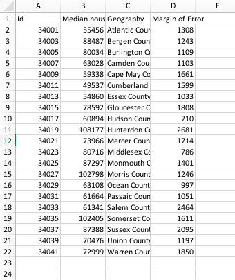

You can find this data under County_income.csv. I've also included a dataset that just has the county names and FIPS codes, under County_fips_codes.csv. You could use this by copying and pasting the codes into any county spreadsheet —just make sure you have the counties in the right order first. 

As mentioned in the previous tutorial, make sure your data is clean, every column is in the right format and there are no missing rows or columns. This time, you also might want to make sure the FIPS codes are the first column in the data, and the main value you want to emphasize in the second column. You'll find out why in a bit.

#### Selecting a map

Once you've logged into Datawrapper, create a new map: 

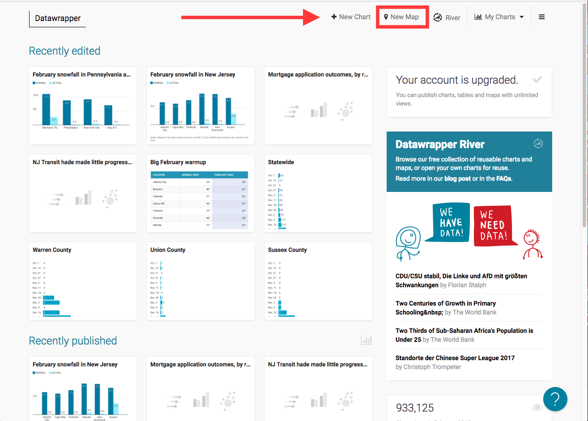

You'll get two options for creating a map:

1. Choropleth map: A fancy word for a color-coded map. This is best when you want to use a color range to designate an area, like a county. 
2. Symbol map: One point for every spot in the data, best for datasets with lat/long locations. 

We want a choropleth map. 

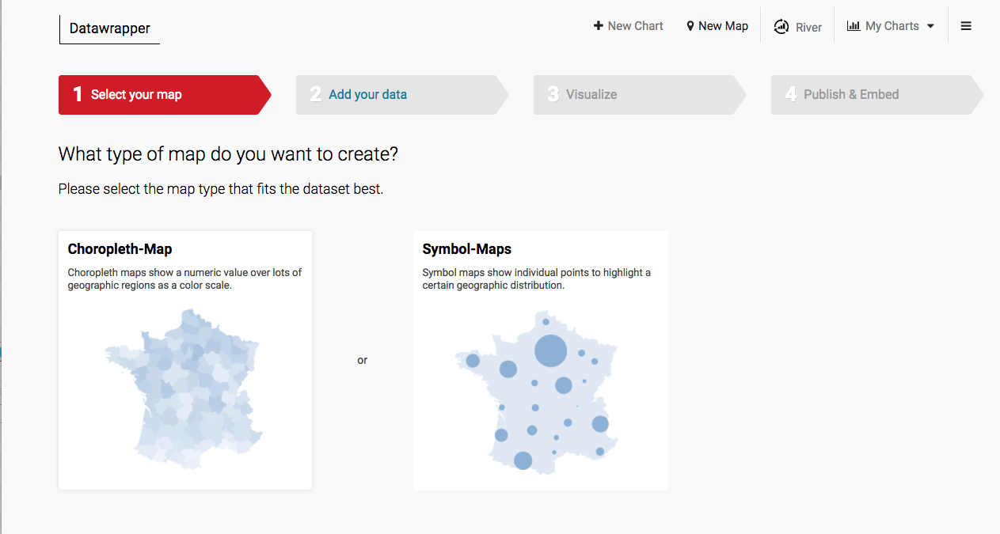

You'll be taken to a screen that asks you to pick from a large number of preset Datawrapper maps. Search for the one you want. For this one, it'll be New Jersey counties: 

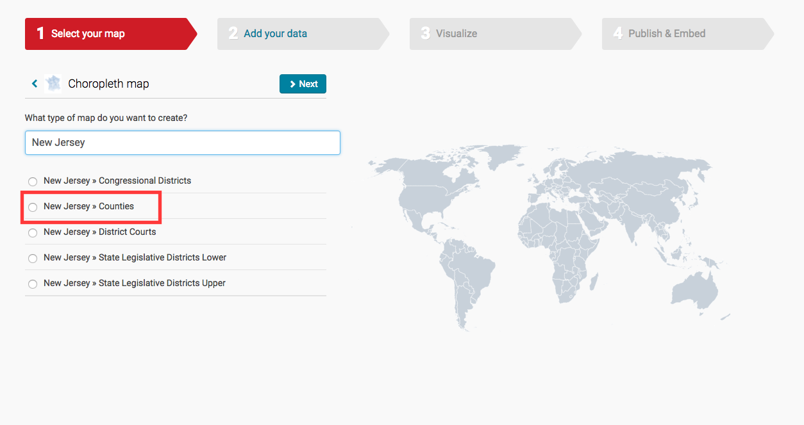

In case you're looking, the United States one is a little hard to find, it's under "USA":

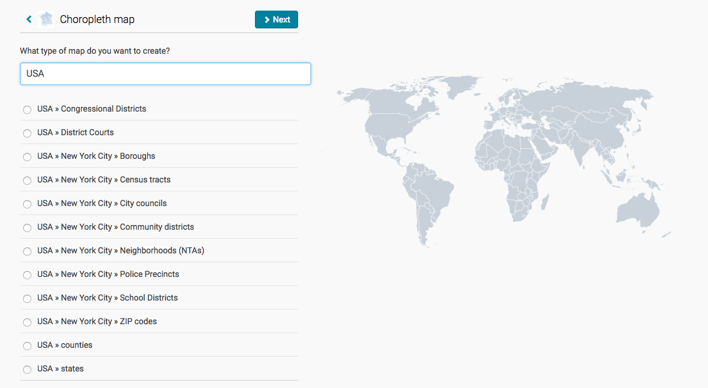

After you've selected the one you want, click to proceed to the next section.

#### Adding your data

You have two options here. The first is to copy and paste your data into the boxes next to the FIPS code. 

To do this, make sure you are putting the value you want used in the map under "Value." Otherwise you might get something that looks like this: 

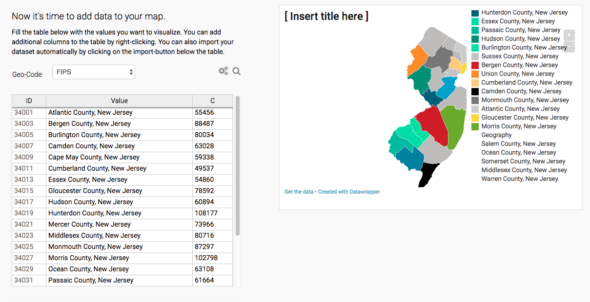

In other words, to copy and paste it in, you need to have your data in the format FIPS code -- data -- data label, and have the FIPS codes in the same order. 

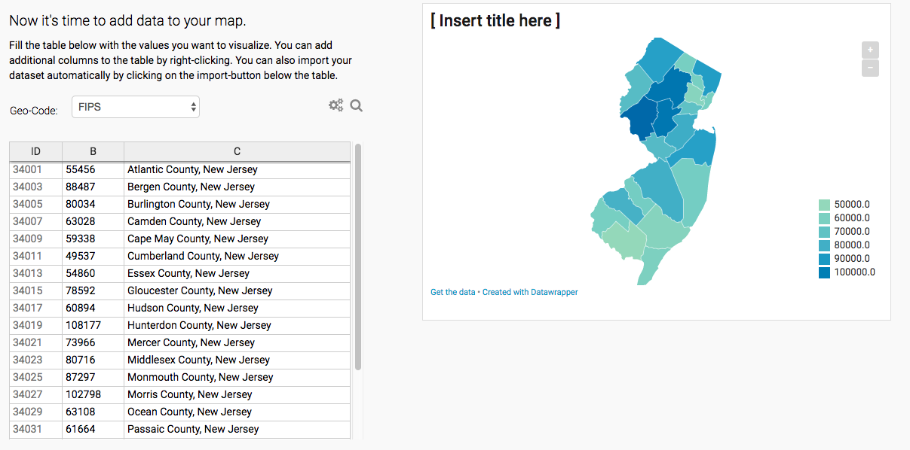

"But I've got a billion codes / I don't feel like changing my format!" I understand. After all, I forgot these rules and put my county names first. Luckily, there's another way: The "import dataset" link in the bottom left of the page. 

You can copy and paste your data in whatever order you have it: 

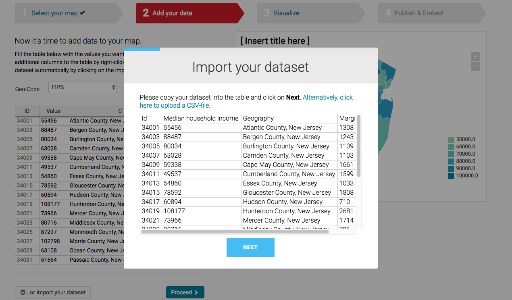

Now, tell it which column is your FIPS code: 

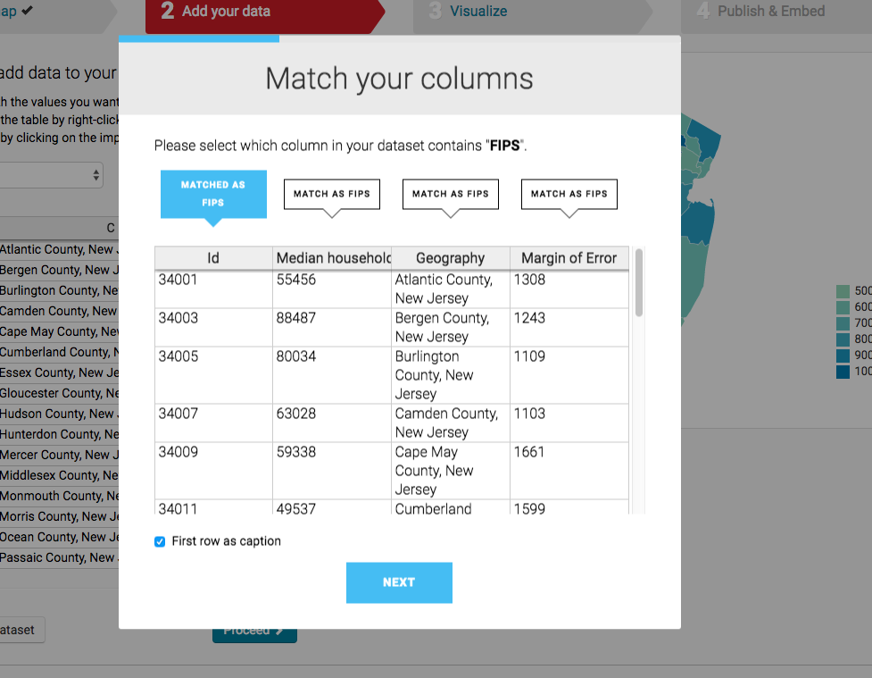

It'll try to guess which column you want displayed as the map color. It picked wrong at first:

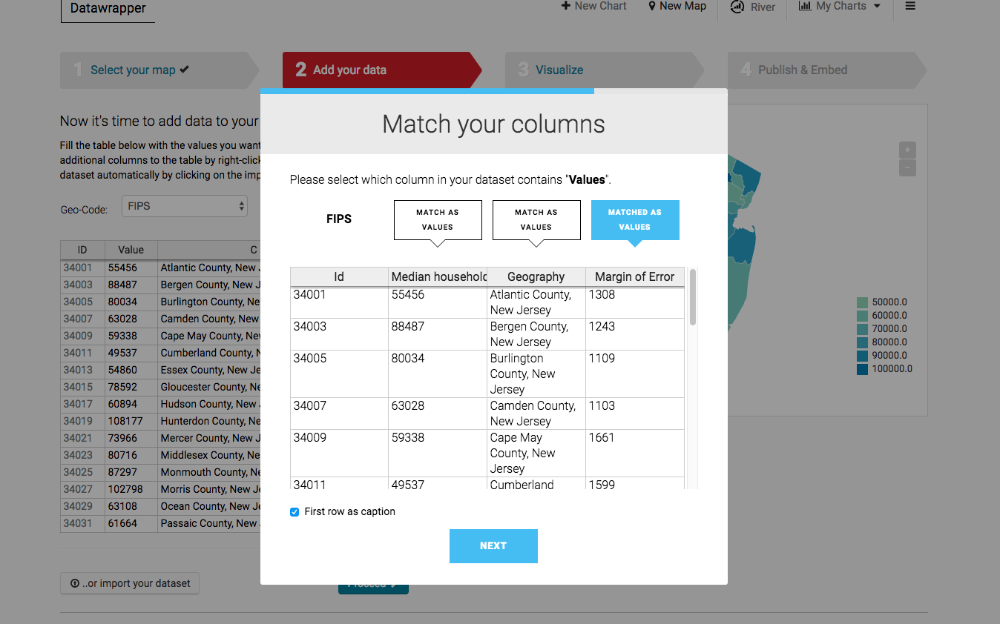

I corrected it to show the income values: 

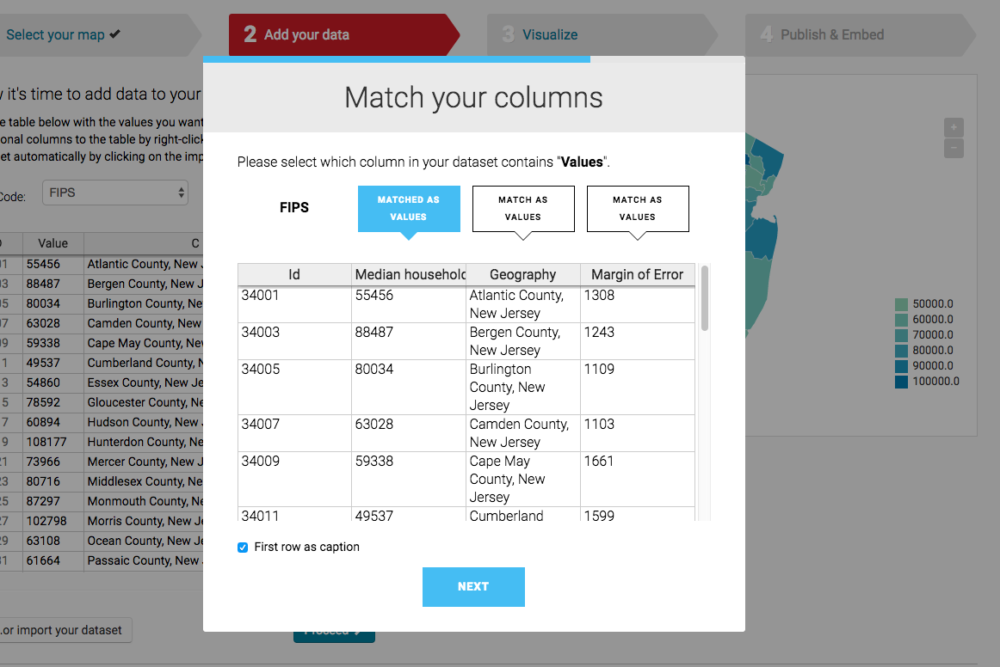

You've got a map! Time to move on to the next step: Prettying it up.

#### Styling and detailing your map

Datawrapper tries to auto-style your map for the most part. Here's what it got for me: 

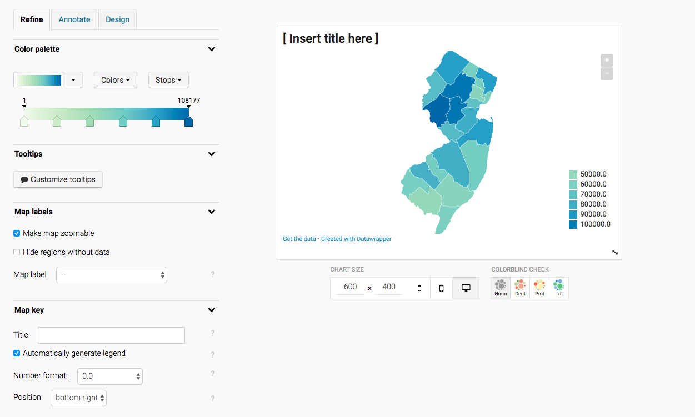

Here's what I did to it:

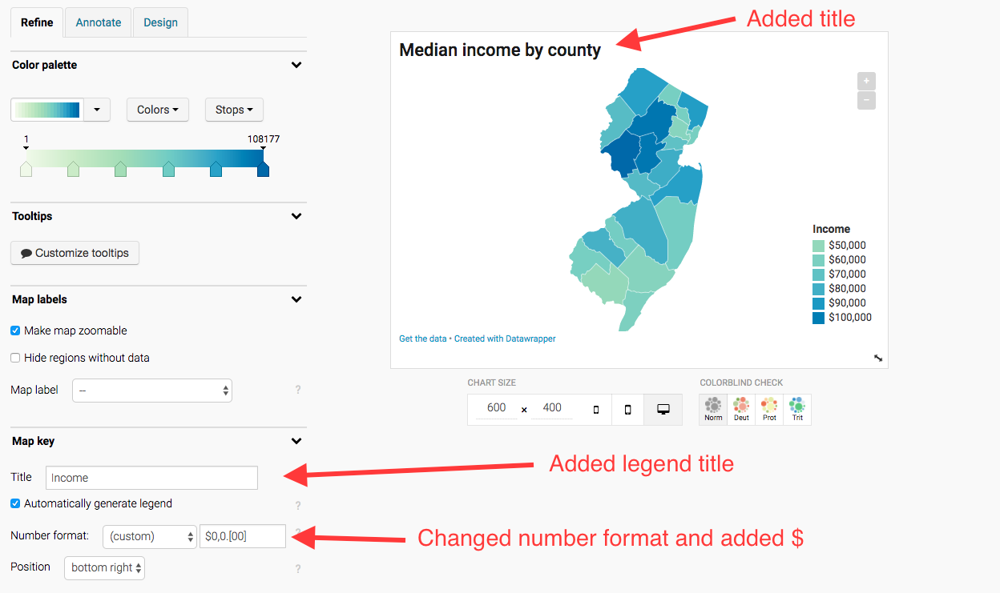

My advice on design: 

1. keep the colors simple — Datawrapper has already picked a few palettes that look good on the web. 
2. A legend is a good way to give readers a general impression of the data range. Don't go overboard on adding details to it -- you can add them to the top or bottom of the chart. 
3. Labels are usually too busy and overlapping. It's better to use tooltips, which I will explain below.

#### Adding a tooltip

The tooltip design is a little confusing. What are these column names doing there? And what's with the brackets?

The idea is that the column names stand for what will show up when the person clicks on the county. And the brackets show the data that will be inserted, rather than the things you will add yourself. 

Here's a gif to show you how I did it: 

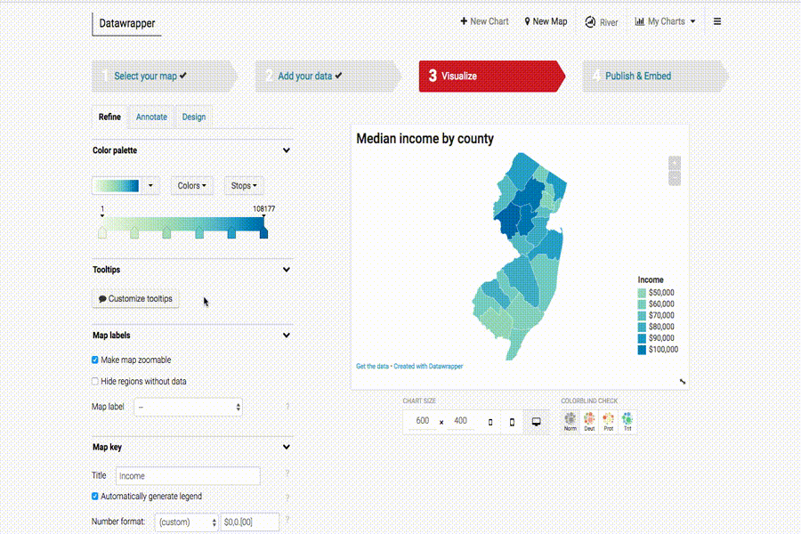