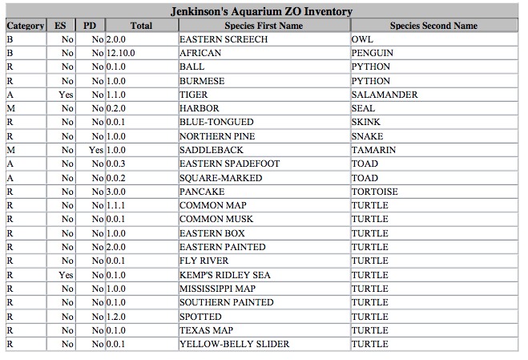
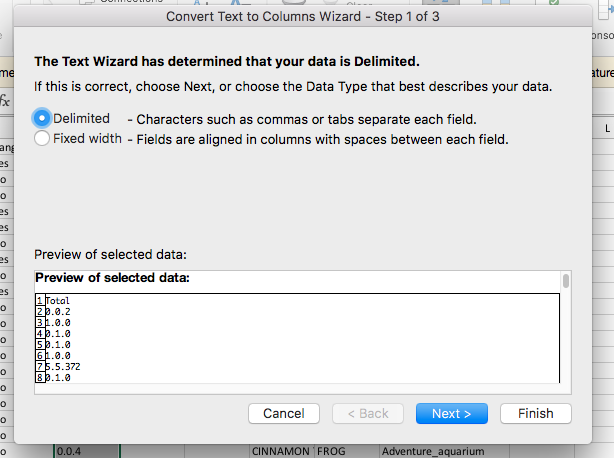
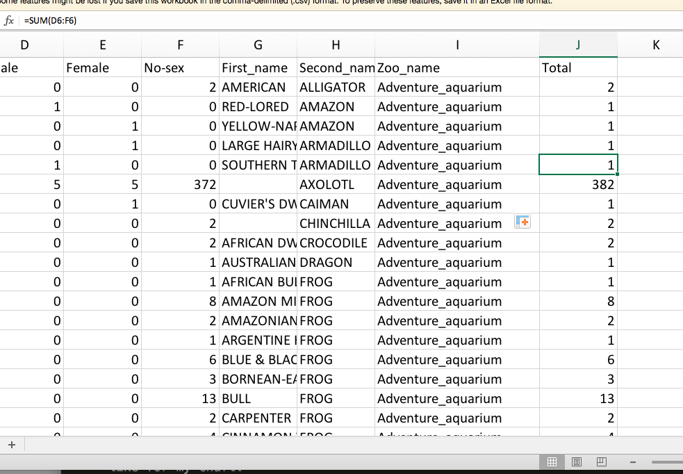

# Datawrapper tutorial

###### Using Datawrapper.de to create charts and maps. 
------

We use Datawrapper to create charts all the time at NJAM. But it can be difficult to pick up, especially with odd directions and lots of detailed options. Here's a primer to get you up to speed on Datawrapper

## Part 0: Prequel to Datawrapper training - Excel basics. 

You may have opened an Excel file, maybe played around with copying and pasting and other things. But analysis is a bit more elusive. Here's a tutorial to get you started on some common Excel tips.

### Open your dataset

This data is based on New Jersey's inventory of zoo animals. The original data came back to us in a PDF like this:

I took it from the PDFs with a tool called Tabula and created separate datasets for each zoo. Then I combined all of those datasets into one. That's the Zoo_Total.csv.

Before you even start on the Excel file, I want to show you what the dataset looks like to the computer. You can see that pretty easily with a csv file -- it's just a text file with some commas thrown in. Try right clicking on the file and telling it to open in Text Edit, Notepad or a different text editor. It should look something like this:

Keep in mind that csv files don't save formulas or other fancy things you might add to an Excel spreadsheet. If you want to add that stuff to your file, you might want to save it as an Excel spreadsheet as soon as you open it.

### Grids, selection, and hidden notes

Time to open up that dataset. First off, scroll through and notice some basic things that could mess up your calculations:

1. Are all the columns labeled correctly?
2. Are the column names in the top row? Are the column names only one row, or are they multiple row?
3. Are all the rows aligned to the right column? Are there any "dangling" cells?
4. If there are numbers, are the numbers aligned to the right, like they should be? Usually Excel puts numbers on the right of the cell, and text on the left. If that's screwed up, you may have a number being read as a text value.
5. Are there blank cells? Cells with negative numbers? Cells with things like #N/A written in them?
6. For columns that only have a handful of values (like Yes or No), are there any obvious misspellings?

Now, before we go on, do you know how to select a cell? How about copying and pasting?

If you need a refresher course on that stuff, [this spreadsheet](https://docs.google.com/spreadsheets/d/1pEJ8tFpMvRKaztSl-OKJBNOWzu9SPDOcmcp2eGm-fOQ/edit?usp=sharing) is a good start. Make a copy and go crazy.

Just to overview a little bit: 

- Click on a single cell one to highlight it and view it in the "formula bar" (the big white bar up top). Double click to change the value in the cell.
- When you select a cell, the row number (on the left) and column letter (on the top) will light up. To select an entire row, click on that number. To select an entire column, click on that letter. To select a range of cells, click on one cell and drag your mouse over the other cells you want to select.
- Sometimes, the displayed value is not the same as the value Excel sees — particularly if you have a formula. To see the "real" value, click on the cell and take a peek at the formula bar.
- You can copy and paste cells, rows, columns and tables by selecting them, then copying and pasting like you would in an Excel spreadsheet. There's one caveat: You can either paste the thing Excel sees -- with the hidden formulas and all -- or the thing that you see. To paste without formulas or hidden stuff, use Edit - Paste - Values.

### First data cleaning point: Get rid of those dots!

You want to find out the total number of each animal? Great, too bad it's hiding in that weird "Total" column. Somehow, you need to separate the male, female and no-gender stuff into different columns. To do that, you need to use the magic of "Text to columns."

To do that, you first need to make room for it. Highlight columns E and F and right click - Insert columns. Then highlight column D, the column you need to separate. Go to the Data tab and click on Text to columns. 

Something will pop up like this:

Your first option will tell the computer "here's the thing that's separating (delimiting) the values I want to turn into individual columns." The second tells the computer "I want you to turn each thing x spaces away into a different column." You have a thing separating your values, not a space, so you want the first option -- the "Delimited" one.

The second screen will ask you, "what's the thing that's separating your data?" In this case, each value is separated by a period. It's not one of the preset options, but no worries: You can input it.

You don't have to worry too much about the last screen: Set it to General unless you have a reason to do otherwise. Now click "Finish." You should now have this showing:

### Getting the totals with FORMULA

You have the values you want, but you don't quite have the right results. You don't want the number of male or female animals, you want the combined numbers, right? To do that, you have to try something new: A formula.

Formulas tend to scare reporters, and I can see why: Their odd syntax, hidden nature and huge variety make them hard to grasp at first. But for this exercise, we are going to use the simplest formula you can possibly imagine: the SUM function.

First off, let's get used to what formulas look like. Every formula has a couple different components:

- The equal sign: It tells Excel "This isn't a regular cell value, it's a formula."
- The name of the function: It tells Excel what function you want to use.
- The opening and closing parenthesis: It tells Excel, "The thing you want to run is inside this parenthesis"
- The cell reference: These are the cells you want to run the function for. You can select cells in a couple different ways. You can write in the cell reference you want, such as typing in "D2" to reference the second cell in the forth column. Or, once you've written =Sum(, you can click and drag over the cells you want to select. The ":" means "Select from this cell to this cell." 

Once you've got the formula you want, hit Enter and watch Excel work its calculation magic. If a little yellow triangle pops up, you've got an error. Clicking on that triangle tells you the nature of the error, but I'll admit Excel is frustratingly vague about those errors sometimes. If you need to access that formula again, click on that cell then start typing in the formula bar, or double-click on the cell.

Ready to run that formula for the entire column? You can do it two ways: Mouse over the lower right hand corner of that cell until you see a little black cross. You can hold and drag the cross down to run the formula in those cells, or double-click on the cross to automatically fill the bottom cells.

As you copied the formula into other cells, Excel changed the cells reference to match that area. For example, on row 6, Excel guessed that you wanted to run the formula on other cells in the sixth row: 

Sometimes you don't want the formula's cell reference to change, but just want to repeat the same results all over again. To do that, you'll need to use a "$" like this: 

For now, you don't need to worry about it.

**Learned something? Want to take it to the next level? Check out [Part 2: Maps.](../Part_2.md)**