# Datawrapper tutorial

###### Using Datawrapper.de to create charts and maps. 
------

We use Datawrapper to create charts all the time at NJAM. But it can be difficult to pick up, especially with odd directions and lots of detailed options. Here's a primer to get you up to speed on Datawrapper.

## Links:

[Part 0: Excel training](https://github.com/epetenko/datawrapper-tutorial/blob/master/Prequel.md)
[Part 0 data](https://github.com/epetenko/datawrapper-tutorial/blob/master/Zoo_Total.csv)
[Part 1: Basic chart](https://github.com/epetenko/datawrapper-tutorial)
[Part 2: Mapping](https://github.com/epetenko/datawrapper-tutorial/blob/master/Part_2.md)

## Part one: basic chart. 

### Get your data and clean it

Datawrapper can handle a lot of data, but it can be a bit picky about how you enter the data. For this example, we're going to use a bit of data that's already fairly clean, an old sheet with data on the number of animals in New Jersey zoos: 

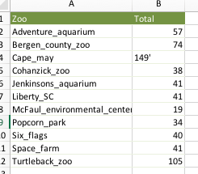

Here are some key things to check before you import your data:

1. Your columns and rows should be continuous — that is, you shouldn't leave any extra columns or totally empty rows lying around. A couple empty cells are ok. This data looks good: Two complete columns and 12 complete rows.
2. Your column names should be in the first row, clearly labeled. 
3. For names, labels and other text, make sure they're exactly as you want them displayed in the chart. In this case, we need to take out the _ markers and replace them with spaces.
4. For numbers and dates, **the only thing in the cell should be the number itself.** No $ or % symbols in there, for example. (Don't worry, you can add them back in later.) You might notice that Excel warns me about this; the number next to Cape May zoo has an extra symbol, so Excel is putting it to the left to tell me it looks like text. I need to take out that little mark.

Here's the new, cleaned version:

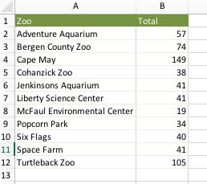

### Put it into Datawrapper

Once you've logged into Datawrapper, you start by clicking on the "New Chart" link. 

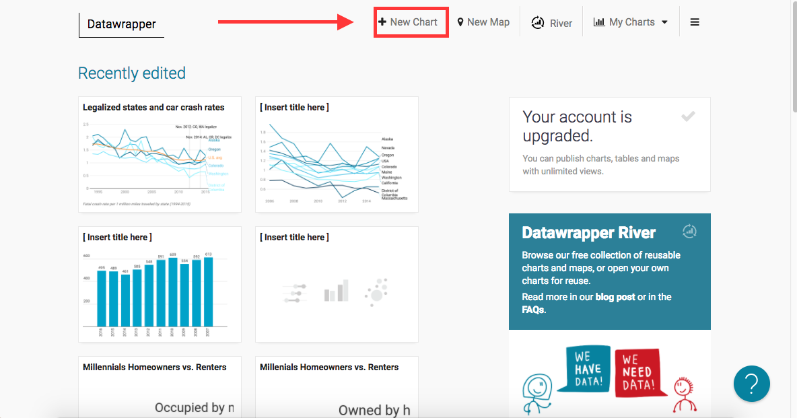

There are two ways you can import data. You can copy and paste it directly from your spreadsheet. To do that, go to your Excel file, highlight _all_ of the cells you need and _only_ the cells you need, then paste them into the text box. You'll get something like this: 

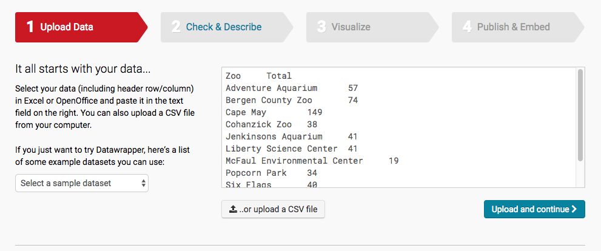

_Nerd note: Most of the time, that's all you'll need to do. But there's another option — you can upload a CSV file directly into Datawrapper. [This site](https://support.bigcommerce.com/articles/Public/What-is-a-CSV-file-and-how-do-I-save-my-spreadsheet-as-one) has an explanation of what a CSV file is and how to make one from an Excel spreadsheet. TL;DR -- make sure to save the csv as a separate file rather than over the existing Excel file, or you might lose some of your fancy Excel additions._

Data look good? Everything ready? Click "Upload and Continue" in the bottom right.

### Check your data

Here's the point where we find out what Datawrapper thinks of your work. It'll tell you the column names and values, and color-code the columns based on what it thinks the data is — text, numbers, or dates. 

If you want to add on dollar signs or percents, this is the place to do it. Click on the checkbox at the top of the column you want to change.

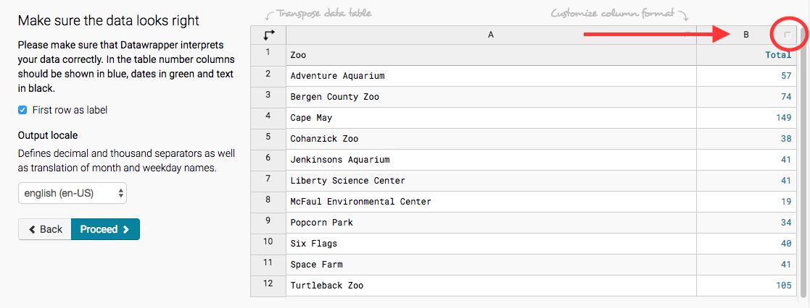

You can divide or round your numbers, which can be helpful if one of your values is 157.68492. You can also add a "$" in the first prepend/append box, or add a "%" into the second. This dataset doesn't need it, but just for example, here's what it looks like:

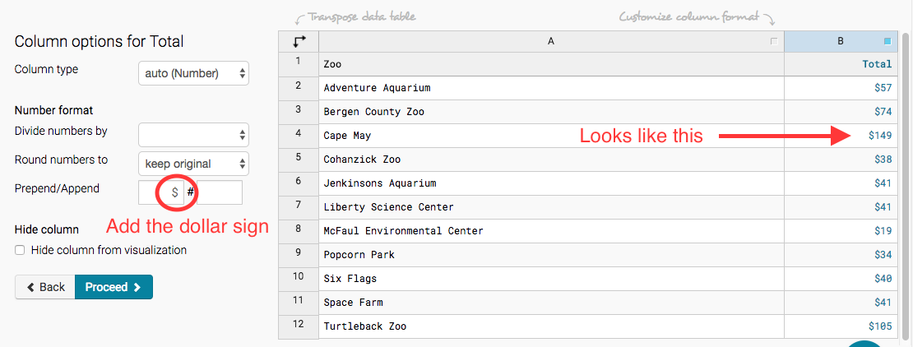

_Nerd note: Why can't I just add the dollar sign in Excel? It has to do with how Datawrapper "reads" the data when you enter it in. When the computer reaches a value, it checks for numerical characters and non-numeric characters, and if it finds a non-numeric character, it labels that value as text. Once it's loaded in, the computer understands the dollar sign is just a label on top of a number. Got that? Whew! You're doing great!_

When it looks good, click "Proceed" to get to the next step.

### Creating your chart

Datawrapper tries to automatically guess what chart you're looking for. Unfortunately, it doesn't always guess too well. Here's what it predicted I wanted for a chart.

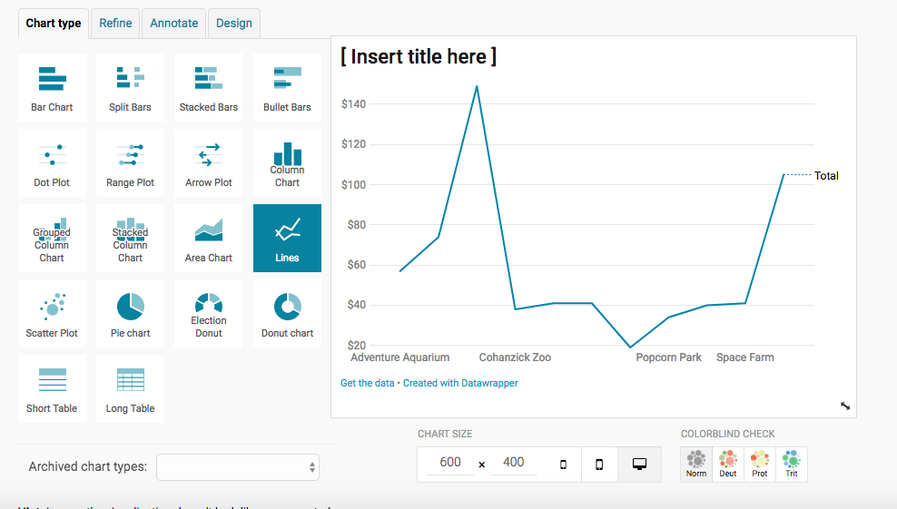

A line chart doesn't make a lot of sense for this data. I want a ranking, not an time comparison. So I just switched it to the type of chart I wanted, a bar chart:

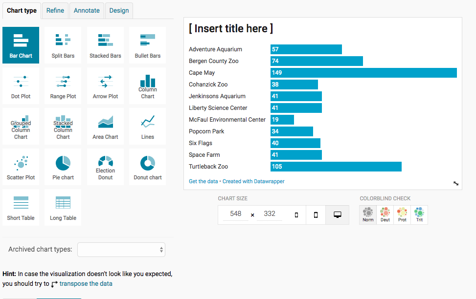

I encourage you to play around and try a bunch of different chart types so you know how they look, but for the most part, keep it simple. Our readers want to be able to glance at this chart fairly quickly and get an idea what's going on.

If you have the _kind_ of chart you want but the _order_ just doesn't look right, try transposing the data — there's an option to do that in the bottom left. This one works just fine for me, so it's time to style it the way I like. Click Proceed to continue.

### Styling your chart

Datawrapper tries to pick some styling options that work well across a wide variety of platforms. Here's what it looked like for my chart:

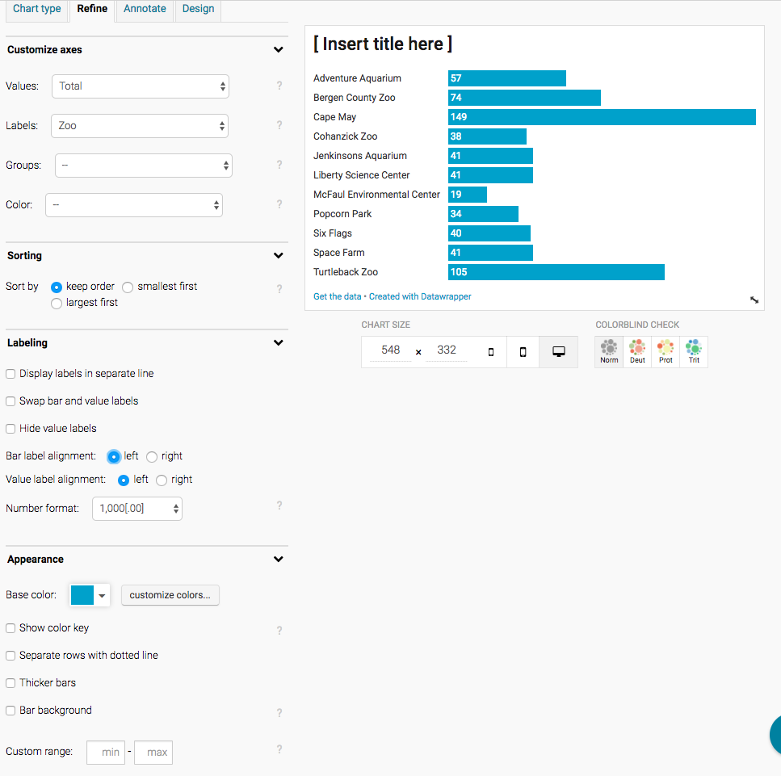

Again, you can play around with the styling options, which are different for different types of charts. Here's my advice on design:

1. See the "chart size" parameter underneath the chart? It's the dimensions — width and height. For stories, your width should be under 600 pixels. For slideshows, it should be around 640 or less. 
2. Don't add too many colors — it gets confused and is difficult to design with nice colors. Plus, not all color coordination works for colorblind readers. It's better to convey your values with sizes, locations and labels.
3. Similarly, your chart should stick to less than 15 "series" — categories, types, lines, etc. (In this case, it's zoos.) Don't try to put 50 different bars into a bar chart — pick the ten biggest values to display. You can always add an "Other" category if need be.

_Nerd box: Want to up your visualization design game? [Here's](http://lenagroeger.s3.amazonaws.com/cuny-fall15/DesignClass5Pres.pdf) a good tutorial._

In the end, I made a handful of changes. I put the bars in order from biggest to smallest, and aligned the text to the bars. Click proceed when you're ready.

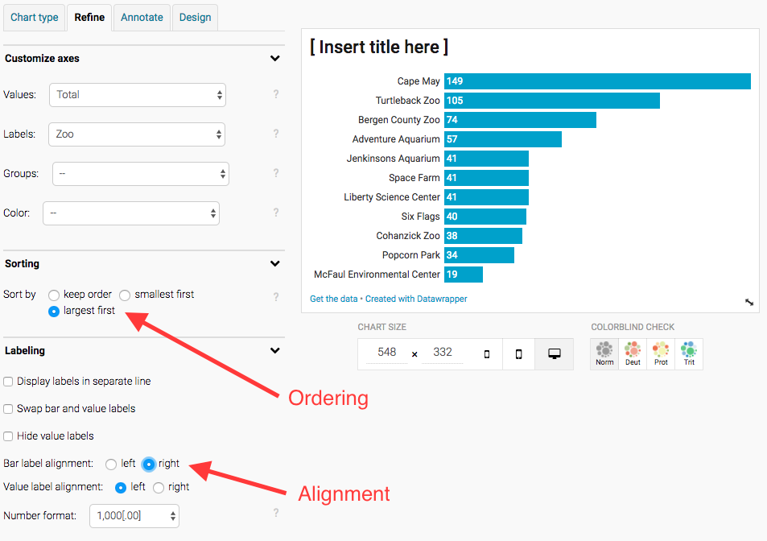

### Annotate your data

The next section lets you add a title, description, and more. Here are the basic ways to add it in:

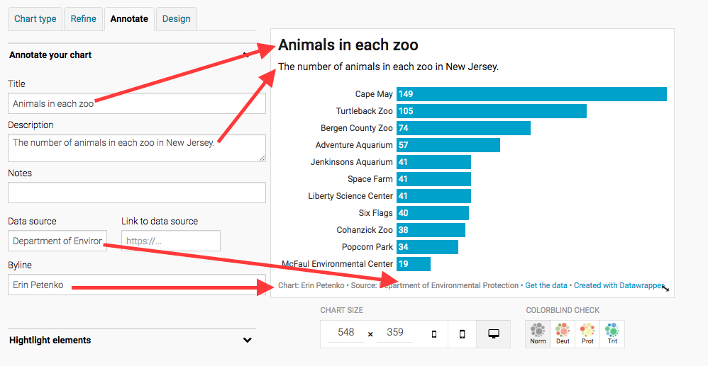

You may want to take the chance to add a source or notes about your methodology or what the chart measures. Click proceed when you're ready.

### Design and publication

After annotations, the next slide sets the overall template of your chart. My advice? Keep the default design. The other ones are rarely used. 

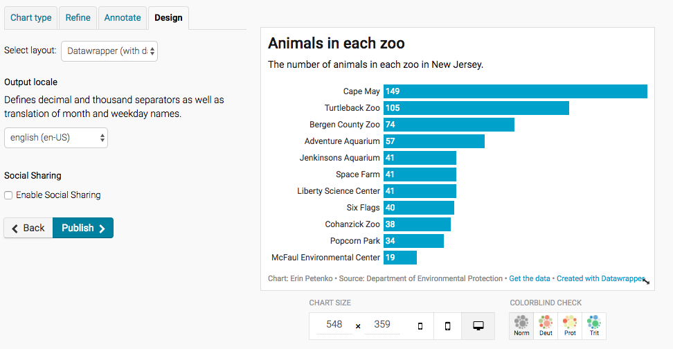

When you're ready, click "Publish" -- but you haven't yet published the chart. You'll be taken to the actual publication screen: 

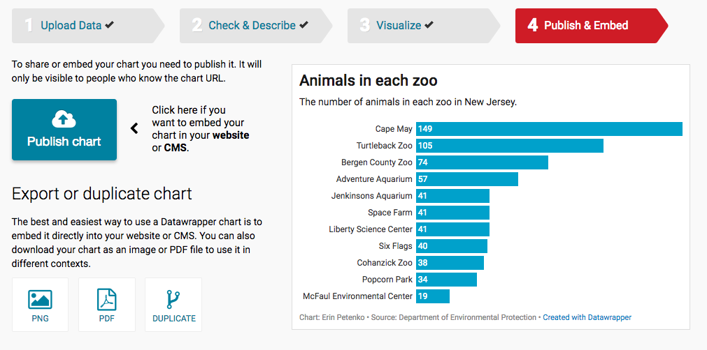

If your chart looks good, you can go ahead and publish at that point. But your chart's not in the story yet. You'll see a link, to share with editors and such, and an embed code: 

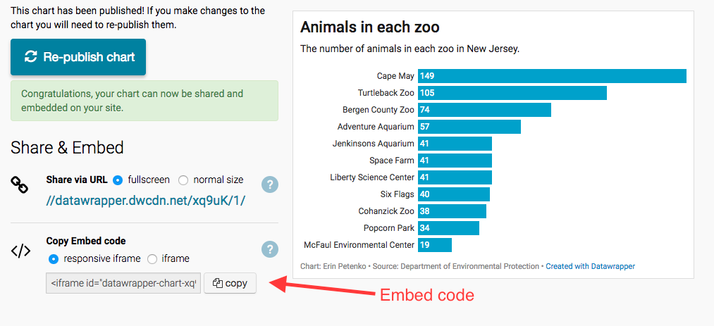

Grab that embed code and insert it into the story the way you'd insert a Twitter link. 

There you go! You've got a nice lil' chart. If you need more information, reach out to the data team or fool around with it.

**Learned something? Want to take it to the next level? Check out [Part 2: Maps.](../Part_2.md)**